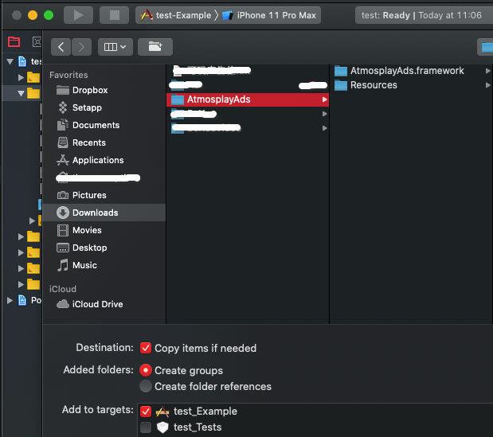
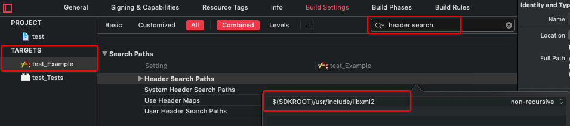

[See the English Guide](https://github.com/Atmosplay/AtmosplayAds-iOS/wiki)

# 入门指南

本指南适用于希望借助 Atmosplay 通过 iOS 应用获利的发布商。  

要展示广告并赚取收入，第一步是将 Atmosplay 移动广告 SDK 集成到应用中。集成该 SDK 后，您就可以进而实施一种或多种支持的广告格式。  

# 前提条件

- 使用 Xcode 10.0 或更高版本。
- 使用 iOS 8.0 或更高版本。
- 创建 Atmosplay Ads App ID 和 AdUnitID, 请阅读[开发者帮助文档](https://github.com/Atmosplay/Help-Center-for-Publisher/blob/master/guides.md)。

# 导入移动广告 SDK
## CocoaPods（首选）

要将该 SDK 导入 iOS 项目，最简便的方法就是使用 [CocoaPods](https://guides.cocoapods.org/using/getting-started)。  
请打开项目的 Podfile 并将下面这行代码添加到应用的目标中：  

```ruby
pod 'AtmosplayAds'
```

然后使用命令行运行：

```s
pod install --repo-update
```

如果您刚开始接触 CocoaPods，请参阅其[官方文档](https://guides.cocoapods.org/using/using-cocoapods)，了解如何创建和使用 Podfile。

## 手动下载

1. 直接下载并解压缩 [SDK 框架](https://adsdk.yumimobi.com/iOS/AtmosplayAds/3.0.0_2019122001.tar.bz2)，然后将以下框架导入您的 Xcode 项目中：



2. 将 `-ObjC` 链接器标记添加到项目的 Build Settings 下的 `Other Linker Flags` 中：


3. 将 `$(SDKROOT)/usr/include/libxml2` 链接器标记添加到项目的 Build Settings 下的 `Header Search Paths ` 中：



4. 将以下动态库添加到您的工程中：
   - `UIKit` 
   - `Foundation`
   - `WebKit`
   - `SystemConfiguration`
   - `MobileCoreServices`
   - `AdSupport`
   - `CoreTelephony`
   - `StoreKit`
   - `Security`
   - `AudioToolbox`
   - `CoreMotion`
   - `AVFoundation`
   - `CoreMedia`
   - `xml2`

## 应用传输安全
[应用传输安全 (ATS)](https://developer.apple.com/library/archive/documentation/General/Reference/InfoPlistKeyReference/Articles/CocoaKeys.html) 是 iOS 9 中引入的隐私设置功能。默认情况下，系统会为新应用启用该功能，并强制实施安全连接。

就任何 iOS 9 和 iOS 10 设备而言，如果运行的是使用 Xcode 7 或更高版本构建的应用且未停用 ATS，那么均会受到此项更改的影响。这可能会影响您的应用与 Atmosplay 移动广告 SDK 的集成。

当不符合 ATS 标准的应用试图在 iOS 9 或 iOS 10 设备上通过 HTTP 投放广告时，系统将显示以下日志消息：

>因为不安全，应用传输安全功能已阻止加载明文 HTTP (http://) 资源。但可通过您的应用的 Info.plist 文件配置临时例外情况。

为确保您的广告不受 ATS 影响，请执行以下操作：


```xml
<key>NSAppTransportSecurity</key>
	<dict>
		<key>NSAllowsArbitraryLoads</key>
		<true/>
	</dict>
```

# Ad Formats
## 横幅
### 创建 AtmosplayBanner

```objective-c
#import <AtmosplayAds/AtmosplayBanner.h>
@interface AtmosplayBannerViewController () <AtmosplayBannerDelegate>
@property (nonatomic) AtmosplayBanner *bannerView;
@end

@implementation AtmosplayBannerViewController
- (void)initBanner {
    self.bannerView =
        [[AtmosplayBanner alloc] initWithAppID:@"YOUR_App_ID" adUnitID:@"YOUR_AdUnitID" rootViewController:self];
    self.bannerView.delegate = self;
    self.bannerView.bannerSize = kAtmosplayBanner320x50;
}
@end
```

### Banner 尺寸

```objective-c
/// Represents the fixed banner ad size
typedef NS_ENUM(NSUInteger, AtmosplayBannerSize) {
    /// iPhone and iPod Touch ad size. Typically 320x50.
    kAtmosplayBanner320x50 = 1 << 0,
    /// Leaderboard size for the iPad. Typically 728x90.
    kAtmosplayBanner728x90 = 1 << 1,
    /// An ad size that spans the full width of the application in portrait orientation. The height is
    /// typically 50 pixels on an iPhone/iPod UI, and 90 pixels tall on an iPad UI.
    kAtmosplaySmartBannerPortrait = 1 << 3,
    /// An ad size that spans the full width of the application in landscape orientation. The height is
    /// typically 32 pixels on an iPhone/iPod UI, and 90 pixels tall on an iPad UI.
    kAtmosplaySmartBannerLandscape = 1 << 4
};
```

### 请求 Banner

```objective-c
- (void)requestBanner {
    if (!self.bannerView) {
        return;
    }
    [self.bannerView loadAd];
}
```

### 实现 AtmosplayBannerDelegate

```objective-c
/// Tells the delegate that an ad has been successfully loaded.
- (void)AtmosplayBannerViewDidLoad:(AtmosplayBanner *)bannerView {
    dispatch_async(dispatch_get_main_queue(), ^{
        CGFloat y = self.view.frame.size.height - (bannerView.frame.size.height / 2);
        if (@available(iOS 11, *)) {
            y -= self.view.safeAreaInsets.bottom;
        }
        bannerView.center = CGPointMake(self.view.frame.size.width / 2, y);
        [self.view addSubview:bannerView];
    });
}  

/// Tells the delegate that a request failed.
- (void)AtmosplayBannerView:(AtmosplayBanner *)bannerView didFailWithError:(NSError *)error {

}  

/// Tells the delegate that the banner view has been clicked.
- (void)AtmosplayBannerViewDidClick:(AtmosplayBanner *)bannerView {

}
```

### 销毁 Banner

```objective-c
- (void)destroyBanner {
    self.bannerView.delegate = nil;
    [self.bannerView removeFromSuperview];
    self.bannerView = nil;
}
```

## 插屏
### 创建和加载 AtmosplayInterstitial

```objective-c
#import <AtmosplayAds/AtmosplayInterstitial.h>
@interface AtmosplayInterstitialViewController () <AtmosplayInterstitialDelegate>
@property (nonatomic) AtmosplayInterstitial *interstitial;
@end

@implementation AtmosplayBannerViewController
- (void)createAndLoadInterstitial {
    self.interstitial = [[AtmosplayInterstitial alloc] initWithAppID:@"Your_App_ID" adUnitID:@"Your_AdUnitID"];
    self.interstitial.delegate = self;
    self.interstitial.autoLoad = YES;
    [self.interstitial loadAd]
}
@end
```

### 展示插屏

```objective-c
- (void)showInterstitial {
    // ad is not ready, do nothing
    if (!self.interstitial.ready) {
        return;
    }
    // show the ad
    [self.interstitial showInterstitialWithViewController:self];
}
```

### 实现 AtmosplayInterstitialDelegate

```objective-c
/// Tells the delegate that succeeded to load ad.
- (void)atmosplayInterstitialDidLoad:(AtmosplayInterstitial *)ads {
}

/// Tells the delegate that failed to load ad.
- (void)atmosplayInterstitial:(AtmosplayInterstitial *)ads didFailToLoadWithError:(NSError *)error {
}

/// Tells the delegate that user starts playing the ad.
- (void)atmosplayInterstitialDidStartPlaying:(AtmosplayInterstitial *)ads {
}

/// Tells the delegate that the ad is being fully played.
- (void)atmosplayInterstitialDidEndPlaying:(AtmosplayInterstitial *)ads {
}

/// Tells the delegate that the landing page did present on the screen.
- (void)atmosplayInterstitialDidPresentLandingPage:(AtmosplayInterstitial *)ads {
}

/// Tells the delegate that the ad did animate off the screen.
- (void)atmosplayInterstitialDidDismissScreen:(AtmosplayInterstitial *)ads {
}

/// Tells the delegate that the ad is clicked
- (void)atmosplayInterstitialDidClick:(AtmosplayInterstitial *)ads {
}
```

## 激励视频
### 创建并请求 AtmosplayRewardedVideo

```objective-c
#import <AtmosplayAds/AtmosplayRewardedVideo.h>
@interface AtmosplayRewardedVideoViewController () <AtmosplayRewardedVideoDelegate>
@property (nonatomic) AtmosplayRewardedVideo *rewardedVideo;
@end

@implementation AtmosplayBannerViewController
- (void)createAndLoadRewardedVideo {
    self.rewardedVideo = [[AtmosplayInterstitial alloc] initWithAppID:@"Your_App_ID" adUnitID:@"Your_AdUnitID"];
    self.rewardedVideo.delegate = self;
    self.rewardedVideo.autoLoad = YES;
    [self.rewardedVideo loadAd]
}
@end
```

### 展示激励视频

```objective-c
- (void)showRewardedVideo {
    // ad is not ready, do nothing
    if (!self.rewardedVideo.ready) {
        return;
    }
    // show the ad
    [self.rewardedVideo showRewardedVideoWithViewController:self];
}
```

### 实现 AtmosplayRewardedVideoDelegate

```objective-c
/// Tells the delegate that the user should be rewarded.
- (void)atmosplayRewardedVideoDidReceiveReward:(AtmosplayRewardedVideo *)ads {
}

/// Tells the delegate that succeeded to load ad.
- (void)atmosplayRewardedVideoDidLoad:(AtmosplayRewardedVideo *)ads {
}

/// Tells the delegate that failed to load ad.
- (void)atmosplayRewardedVideo:(AtmosplayRewardedVideo *)ads didFailToLoadWithError:(NSError *)error {
}

/// Tells the delegate that user starts playing the ad.
- (void)atmosplayRewardedVideoDidStartPlaying:(AtmosplayRewardedVideo *)ads {
}

/// Tells the delegate that the ad is being fully played.
- (void)atmosplayRewardedVideoDidEndPlaying:(AtmosplayRewardedVideo *)ads {
}

/// Tells the delegate that the landing page did present on the screen.
- (void)atmosplayRewardedVideoDidPresentLandingPage:(AtmosplayRewardedVideo *)ads {
}

/// Tells the delegate that the ad did animate off the screen.
- (void)atmosplayRewardedVideoDidDismissScreen:(AtmosplayRewardedVideo *)ads {
}

/// Tells the delegate that the ad is clicked
- (void)atmosplayRewardedVideoDidClick:(AtmosplayRewardedVideo *)ads {
}
```

## 原生广告
### 原生模版广告
#### 创建原生模版广告

```objective-c
#import <AtmosplayAds/AtmosplayNativeExpressAd.h>

@interface NativeTemplatesAdViewController () <AtmosplayNativeExpressAdDelegate>
@property (nonatomic) AtmosplayNativeExpressAd *nativeExpressAd;

@end
```

```objective-c
CGFloat width = [UIScreen mainScreen].bounds.size.width;
// adSize (size of adUnit) is set by you，SDK will return an adview which suits for the adSize
self.nativeExpressAd = [[AtmosplayNativeExpressAd alloc] initWithAppID:@"Your_App_ID" 
                                                              adUnitID:@"Your_AdUnitID" 
                                                                adSize:CGSizeMake(width, 300)];
self.nativeExpressAd.delegate = self;
```

#### 加载原生模版广告
```objective-c
[self.nativeExpressAd loadAd];
```

#### 渲染并展示原生模版广告
您需要在 `AtmosplayNativeExpressAd` 的回调中检测回调状态，若状态为成功，会返回一个 PANativeExpressAdView 类型的view对象，您可以调用`addSubview：`方法，将广告展示到需要的位置。  
*当您展示广告时，需调用`reportImpressionNativeExpressAd`方法来通知Atmosplay Ads广告被展示。*  

#### 实现 AtmosplayNativeExpressAdDelegate

```objective-c
/// Tells the delegate that an ad has been successfully loaded.
- (void)atmosplayNativeExpressAdDidLoad:(PANativeExpressAdView *)nativeExpressAd {
}
/// Tells the delegate that a request failed.
- (void)atmosplayNativeExpressAdDidFailWithError:(NSError *)error {
}
/// Tells the delegate that the Native view has been clicked.
- (void)atmosplayNativeExpressAdDidClick:(PANativeExpressAdView *)nativeExpressAd {
}
```

### 原生自渲染广告
#### 初始化 AtmosplayNative

```objective-c
#import <AtmosplayAds/AtmosplayNative.h>

@interface NativeAdViewController () <AtmosplayNativeDelegate>
@property (nonatomic) AtmosplayNative *nativeAd;

@end
```

```objective-c
self.nativeAd = [[AtmosplayNative alloc] initWithAppID:@"Your_AppIDs" adUnitID:@"Your_AdUnitID"];
self.nativeAd.delegate = self;
```

#### 加载原生自渲染广告

```objective-c
[self.nativeAd loadAd];
```

#### 渲染及展示原生广告
在`AtmosplayNative`的回调中，检测广告回调状态，成功之后，会返回一个`AtmosplayNativeAdModel`的广告对象，在合适的时机渲染广告界面并进行展示。  

*注意：*  
*渲染完毕曝光给最终用户时需调用`reportImpression:view:`方法告知Atmosplay Ads已经渲染完毕并曝光。*    
*将`AtmosplayNative`与您将用于显示原生广告的`UIView`相关联，调用方法`registerViewForInteraction: nativeAd:` 。请确保关联view的 `view.userInteractionEnabled = YES;`*  

#### 实现 AtmosplayNativeDelegate

```objective-c
/// Tells the delegate that an ad has been successfully loaded.
- (void)atmosplayNativeAdDidLoad:(AtmosplayNativeAdModel *)nativeAd {
}
/// Tells the delegate that a request failed.
- (void)atmosplayNativeAdDidFailWithError:(NSError *)error {
}
/// Tells the delegate that the Native view has been clicked.
- (void)atmosplayNativeAdDidClick:(AtmosplayNativeAdModel *)nativeAd {
}
```

## Tools and Debugging
### GDPR

```objective-c
typedef enum : NSUInteger {
    /// The user has granted consent for personalized ads.
    PlayableAdsConsentStatusPersonalized,
    /// The user has granted consent for non-personalized ads.
    PlayableAdsConsentStatusNonPersonalized,
    /// The user has neither granted nor declined consent for personalized or non-personalized ads.
    PlayableAdsConsentStatusUnknown,
} PlayableAdsConsentStatus;

[[PlayableAdsGDPR sharedGDPRManager] updatePlayableAdsConsentStatus:PlayableAdsConsentStatusPersonalized];
```

### Test ID

| OS  | Ad_type                  | App_ID                               | Ad_Unit_ID                           |
| --- | ------------------------ | ------------------------------------ | ------------------------------------ |
| iOS | Rewarded video           | A650AB0D-7BFC-2A81-3066-D3170947C3DA | BAE5DAAC-04A2-2591-D5B0-38FA846E45E7 |
| iOS | Intertitial              | A650AB0D-7BFC-2A81-3066-D3170947C3DA | 0868EBC0-7768-40CA-4226-F9924221C8EB |
| iOS | Native Managed Rendering | A650AB0D-7BFC-2A81-3066-D3170947C3DA | DC9E199C-7C0B-FBFC-7E5A-26E7B5EE6BB3 |
| iOS | Native Self Rendering    | A650AB0D-7BFC-2A81-3066-D3170947C3DA | 25AED008-6B6F-BADB-F873-AE7CA61DFE98 |
| iOS | Banner                   | A650AB0D-7BFC-2A81-3066-D3170947C3DA | A49521F3-339D-994F-FC80-F9C4170AA0CF |